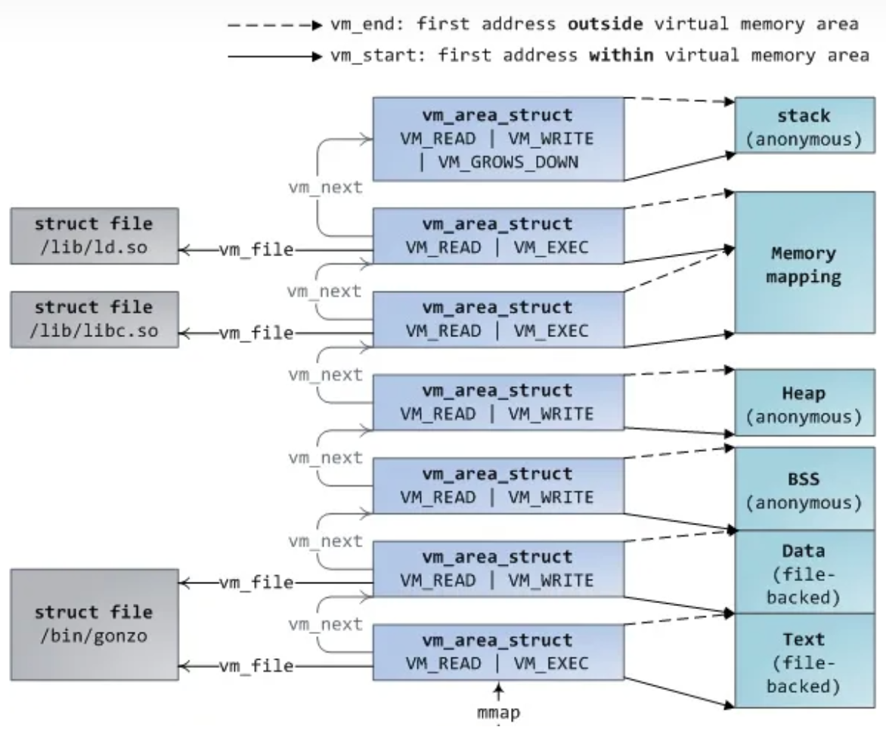

# OS Lab 8 - Memory Management for User Space Programs

本次实验为初步实现一些用户态程序的内存管理功能。包括修改程序堆的大小、Lazy Allocation 和 Copy on Write。

## 基础知识
### ELF格式和段
ELF 是一种用于二进制文件、可执行文件等文件的文件格式，是 Linux 的主要可执行文件格式。ELF 格式将可执行文件分成几个不同的段（`section`，有些地方又称`segment`），一个程序主要由 `anonymous` 段和 `file-backed` 段组成，其中
- `anonymous`段：执行时才会创建的段，可执行文件本身不包含，比如`bss`（减少文件大小）、`stack`（执行时才能确定其中的内容）
- `file-backed` 段：可执行文件本身就拥有的段，比如`text`（可执行文件的代码段）、`data`（已初始化的数据段）

其中从 `text` 到 `stack`，对应的虚拟地址一般是逐渐增加的，见下图

可以通过 `size` 命令查看一个可执行文件的各个段的大小

我们本次实验同样采用段（`struct section`对应于上图中的`vm_area_struct`）的数据结构来标识一个可执行文件在执行时拥有的各类段的信息。

### 虚拟内存
- 隔离性：虚拟内存使得操作系统可以为每个应用程序提供属于它们自己的地址空间，所以一个应用程序不可能有意或者无意的修改另一个应用程序的内存数据，我们在进行本次实验时也需要保证这一点
- 抽象性：进程运行时用虚拟地址，而内核会定义从虚拟地址到物理地址的映射关系，因此进程的运行就无需关注和管理对应的物理内存，这是我们这节课要讨论的许多有趣功能的基础
- **灵活性**：目前的内存映射都是静态的，也就是我们最开始设置好后就不会有改动

  - 内核态映射：相当于直接映射，出于简化的目的，后续也不会修改
  - 用户态映射：针对测试手动映射，比如userproc中的loop，确保不会出现pagefault，因为当时没法处理，现在我们就需要处理了。

  本次实验的关键在于通过page fault，让内核可以更新page table，让用户态进程的地址映射关系变得动态起来，提高系统内存的灵活性

可以通过`(h)top`指令查看进程以及内存的使用情况（比如在top命令中，VIRT表示的是虚拟内存地址空间的大小，RES是实际占用的内存数量），我们发现进程的虚拟地址往往比他们拥有的多，倘若直接把所有的进程的虚拟地址都分配物理页的话，会大幅度降低内存利用率，这是动态分配内存的一个重要优点。

### Page fault

顾名思义，Page Fault 就是让用户进程在执行的时候出错，陷入到内核态再根据执行的错误进行处理，从而让内核动态地控制内存的管理，而当内核处理对应的 Page Fault 时，需要哪些信息呢？

- 引起 Page Fault 的内存地址（far寄存器）
- 引起 Page Fault 的原因类型（esr寄存器）
- 引起 Page Fault 程序计数器值（elr寄存器）

我们利用 Page Fault 可以实现的功能主要分为以下三个部分

- Lazy Allocation
- Copy on Write
- Demand Paging (Final Lab)

#### Lazy Allocation

C语言的动态内存分配基本函数是malloc()，在Linux上的基本实现是通过内核的brk系统调用，在xv6中对应的函数就是sbrk()，该函数使得用户应用程序能扩大自己的heap，参数为page的数量，可以为负表示减少，xv6的示意代码如下：

```C
int sys_sbrk(int n)
{
	...
	addr = myproc()->sz;
	if(growproc(n) < 0)
    	return -1;
	return addr;
}
```

其中调用了 growproc() 函数，直接分配给应用程序需要的物理内存。

> 虚拟内存中提到的**抽象性**：每个应用程序都觉得自己占有了全部的硬件资源（但实际上并不是），而且应用程序来说很难预测自己需要多少内存，所以通常来说，应用程序倾向于申请多于自己所需要的内存。

直接分配会导致大量内存的的浪费，更聪明的做法是只增加进程的 size，等到进程执行到对应地址时会触发page fault，这时我们再调用 kalloc_page 申请物理页，并根据出错的虚拟地址（需要的信息）建立映射

```C
int sys_sbrk(int n)
{
	...
	addr = myproc()->sz;
    myproc()->sz = myproc()->sz+n;
//   if(growproc(n) < 0)
//     return -1;
    return addr;
 }
```

#### Copy on Write

##### Zero Fill On Demand

我们先从一个比较简单的例子入手，还记得BSS段吗，BSS包含了未被初始化或者初始化为0的全局变量。为了节省空间，可执行文件一般不包含这个其中的内容，只在执行时才创建对应的内容。

BSS段初始的内容全部为0，同时每个进程又有BSS段，因此不难想到一个优化的地方：在物理内存中，分配一个page，page内容全是0，然后让所有虚拟地址空间的全0的page都map到这一个物理page上，这样至少在程序启动的时候分配BSS时节省大量的物理内存分配

还记得之前提到的隔离性吗？不同进程的BSS段实际上是不能完全共享的，因此要注意不能写，也就是说对应的PTE必须设置为只读的；那如果一个进程尝试往这个BSS段写入数据应该怎么处理呢？触发了Page Fault，应该怎么做呢？

> 创建一个新的page，将其内容设置为0，并重新执行指令（当然还要把PTE设置成可读写）

当然有所得必有所失，不足之处在于每次写入都触发page fault，而page fault涉及用户态和内核态的交互，试想一下原本只用配置bss段一遍，如果运气不好的话，需要配置bss段每次都要

##### Fork

另外一种写时复制的应用场景，那就是fork时的copy on write

> 当Shell处理指令时，它会通过fork创建一个child进程。该child进程执行的第一件事情就是调用exec运行一些其他程序，而exec做的第一件事情就是丢弃自身地址空间，取而代之的是一个包含了要执行的文件的地址空间。

当我们用fork创建child进程时，与其创建，分配并拷贝内容到新的物理内存，其实我们可以直接共享parent进程的物理内存page。

和 Zero Fill On Demand 的场景同样，一旦一个进程往对应的页面写入时应该怎么办？

> 创建一个新的page，复制之前的内容，并重新执行指令（当然还要把PTE设置成可读可写）。这和Zero page有哪些共同点？

当一个进程exit时需要怎么处理？

> 我们知道exit会释放对应进程的页面，但是，实际上该页面本身可能不能直接释放，因为被多个进程使用，因此我们需要对每个进程的page进行引用计数，当我们释放虚拟内存时，我们将物理内存page的引用数减1，如果引用数等于0，那么我们就能释放物理内存page

```C
struct page{
	atomic_t   count;  //
}
struct pages[page_total]; //根据页面的物理地址找到所属的页面

kalloc_page: refcnt = 1
kfree_page: refcnt -= 1
```

#### 参考

- xv6 book
- MIT6.S081（2020）翻译简介：https://zhuanlan.zhihu.com/p/261362497

## 实验内容
#### 有关的结构体
```c
struct page{
    RefCount ref; // 
}
```
对于每个页面，我们记录它的引用次数。当且仅当引用次数为 0 时，页面应该被释放。
```c
struct section{
    u64 flags;
    u64 begin; // inclusive
    u64 end; // exclusive
    ListNode stnode;
}
```
对于程序的每个段，我们将它的起始地址、结束地址和flags记录在这样的结构体中。
```c
struct pgdir{
    PTEntriesPtr pt;
    SpinLock lock;
    ListNode section_head;
}
```
然后将每个段的结构体以链表的形式连接起来，保存在进程的`pgdir`中。这样我们就知道每个进程的每个段都是从哪里开始的，到哪里结束的了。

Flags 如下：
```c
#define ST_FILE   1 // File-backed
#define ST_SWAP  (1<<1) // Unused, 如果你想写swap可以用
#define ST_RO    (1<<2) // Read-only
#define ST_HEAP  (1<<3) // Section is heap
#define ST_TEXT  (ST_FILE | ST_RO) // Section is text
#define ST_DATA   ST_FILE // Section is data
#define ST_BSS    ST_FILE // Section is bss
```
#### 有关的函数
```c
int pgfault_handler(u64 iss) {
    struct proc *p = thisproc();
    struct pgdir *pd = &p->pgdir;
    u64 addr = arch_get_far(); // Attempting to access this address caused the page fault
    // TODO:
    // 1. Find the section struct that contains the faulting address `addr`
    // 2. Check section flags to determine page fault type
    // 3. Handle the page fault accordingly
    // 4. Return to user code or kill the process
}
```
这是缺页异常处理程序，在`trap_global_handler`中，我们需要判断trap是否是缺页异常，如果是，则交由这个函数处理。
### 任务一：实现 `sbrk()` 系统调用
该系统调用的功能是"Set Program Break"，即设置进程的堆的终止位置。
> 本次实验中暂不需要在`SYSCALL_TABLE`中注册该系统调用

函数模板：
```c
u64 sbrk(i64 size);
```
- `size`：堆大小的增加量（字节），可以为负数
- 返回值：原来（修改前）的堆终止位置的地址，如果参数非法则返回`-1`
#### 实现思路
1. 要想设置堆的大小，首先进程需要有一个堆。我们可以在初始化进程时为进程创建一个初始大小为0的堆，并将该`section`记录在进程的`pgdir`中。
2. 当用户程序调用`sbrk()`时，我们需要将堆的终止位置增加`size`，并返回修改前的堆终止位置的地址。我们将新的堆终止位置记录在`section`结构体中，并通过 Lazy Allocation 的方法来实现新的页的分配（参见任务二）。

### 任务二：实现 Lazy Allocation 和 Copy on Write
#### 实现思路
##### Lazy Allocation
> 在本实验中，我们只需要关注 heap 段。其他段会在后续实验中涉及。
1. 当用户程序调用 `sbrk()` 时，我们并不需要立即将新的页map给用户进程，只须把新的 heap 终止位置记录到`section`结构体中即可。
2. 这样，当用户程序访问到新的 heap 时，会触发缺页异常，我们在缺页异常处理程序中，判断缺页地址是否在 heap 中，如果是，说明应当是 Lazy Allocation 的情形。（这种判断方法是否严谨？）
3. 这时分配一个新的页，将这个页map给用户进程，再返回用户进程继续执行即可。
4. 如果不是，则这是一个非法内存访问，应该杀死用户进程并报错。
5. 特别注意，`sbrk()`非但可以增加heap的大小，还可以减小heap的大小（也可以不变）。减小时应该如何处理？
##### Copy on Write
> 本实验中并不会出现需要 Copy on Write 的场景，因此我们在 test 中手动创建了到共享全零页的映射。在后续实验中，我们会在创建bss段和`fork()`时使用 Copy on Write。

> 我们在本次实验中模拟对于共享全零页的 Copy on Write。
1. 我们在系统启动时分配出来一个页，将其内容初始化为全零。我们将该页指定为“共享全零页”，每次有进程需要创建一个全零页时，我们创建一个到共享全零页的**只读**映射即可。需要保证该页永远不会被释放。
2. 如果进程需要对全零页进行**写入**操作时，会触发缺页异常。同样地，我们可以在缺页异常处理程序中判定这是否是 Copy on Write 的情形。
3. 如果是，我们分配一个新的页，将共享全零页的内容拷贝过去（也就是将新的页全设为零），然后将新页map给用户进程，再返回用户进程继续执行即可。
4. 如果不是，则这是一个非法内存访问，应该杀死用户进程并报错。

### 特别提醒
修改页表后需要调用`arch_tlbi_vmalle1is()`以清空TLB

## 提交

**提交：将实验报告提交到 elearning 上，格式为`学号-lab8.pdf`。**

**<u>截止时间：2023年12月15日 23:59。</u>逾期提交将扣除部分分数。**

报告中可以包括下面内容

- 代码运行效果展示（测试通过截图）

- 实现思路和创新点

- 对后续实验的建议

- 其他任何你想写的内容
  
  > ~~你甚至可以再放一只可爱猫猫~~

报告中不应有大段代码的复制。如有使用本地环境进行实验的同学，请联系助教提交代码（最好可以给个git仓库）。使用服务器进行实验的同学，助教会在服务器上检查，不需要另外提交代码。